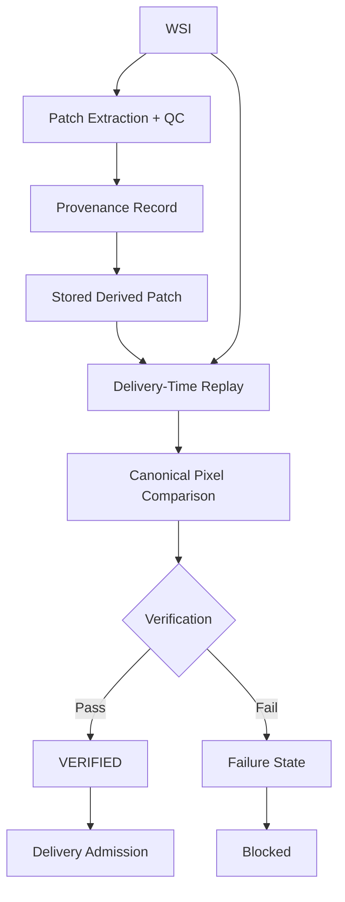

# PathoTrust

Trusted provenance verification and de-identified delivery for digital pathology datasets.

## Overview

PathoTrust is a local-first toolkit for digital pathology dataset processing and controlled delivery. It supports WSI ingestion, metadata processing, tissue-aware patch extraction, quality control, provenance capture, strict deterministic replay verification, optional annotation spatial provenance, hierarchical de-identification, and delivery admission control.

The project is branded as **PathoTrust**. Some internal Python modules retain the historical `pathodataforge` package name for compatibility with the validated codebase.

## Why PathoTrust

A manifest can record where a stored patch is claimed to come from. PathoTrust can additionally verify that claim immediately before delivery:

1. resolve the declared WSI by its exact content instance;
2. re-extract the patch using its recorded level-0 range and versioned extraction/normalization profile;
3. convert the stored and replayed patches to the same canonical pixel representation;
4. compare the canonical pixel results deterministically; and
5. block delivery when the declared derivation cannot be verified.

This verifies reproducibility of the declared derivation, rather than merely comparing manifest fields or encoded image-container bytes.

## Core workflow



## Optional annotation provenance

An annotation can be bound to an exact WSI content instance, represented in level-0 coordinates, and checked against a patch range by recomputing their declared spatial relationship:

```text
Annotation
→ exact WSI content binding
→ level-0 geometry
→ spatial relation recomputation
→ composite validation
```

Spatial provenance validation does not generate or alter training labels.

## Key capabilities

- exact content-instance source resolution;
- versioned extraction and pixel-normalization profiles;
- deterministic patch replay;
- canonical pixel comparison;
- fail-closed validation;
- optional annotation spatial provenance;
- delivery admission control;
- tissue detection, patch quality control, and feature extraction;
- hierarchical pseudonymous indexing; and
- separation of public delivery data from private identity mappings.

## Validation states

`CANDIDATE` identifies a retained patch that still requires delivery-time verification. Verification produces one of the following outcomes:

- `VERIFIED`
- `SOURCE_MISMATCH`
- `PATCH_REPLAY_MISMATCH`
- `GEOMETRY_MISMATCH`
- `OUT_OF_BOUNDS`
- `AMBIGUOUS_SOURCE`
- `UNSUPPORTED_PROFILE`

Only `VERIFIED` retained patches are admitted. The current strict package implementation does not create the delivery package if any retained patch is not `VERIFIED`.

## Deterministic replay boundary

The current replay implementation intentionally uses a strict boundary:

- lossless patch formats supported by the recorded profile;
- canonical RGB, 8-bit, HWC, tightly packed pixel representation;
- pixel-result equality rather than PNG/TIFF container-byte equality;
- lossy JPEG patches are unsupported;
- no perceptual similarity or undocumented tolerance; and
- missing, changed, or unsupported profiles fail closed.

The profile records the source content digest, coordinate convention, level and downsample, read/output size, resampling, bounds and padding policy, orientation, decoder identity/version, channel/alpha/color handling, data type, and canonical representation.

## Privacy model

PathoTrust can generate hierarchical pseudonymous identifiers using a hospital-local secret, while keeping the re-identification mapping in a private local domain. Public delivery data excludes that mapping and the secret. Replay source resolution uses the concrete WSI content instance, not the logical pseudonym.

Never commit or distribute a hospital secret or a production re-identification mapping.

## Installation

Python 3.10 or newer is required.

```bash
python -m venv .venv
source .venv/bin/activate
pip install -r requirements.txt
```

Real `.svs`, `.ndpi`, `.mrxs`, and related WSI formats normally require the system OpenSlide library in addition to `openslide-python`. Pillow is used for supported ordinary image formats and lightweight tests.

Optional feature extractors may require their upstream model packages or model access. For example, CONCH can be installed from its official repository when that extractor is needed:

```bash
pip install git+https://github.com/Mahmoodlab/CONCH.git
```

## Usage

Start the desktop application:

```bash
python main.py
```

Run the processing pipeline with a YAML configuration:

```bash
python -m pathodataforge.cli --config configs/default.yaml
```

Generate local synthetic demo inputs when needed:

```bash
python scripts/generate_demo_data.py
```

The GUI exposes project import, metadata matching, WSI preview and sampling, feature extraction, processing/export, and reporting. Delivery creation invokes deterministic replay verification before copying retained derived assets into the delivery set.

## Testing

```bash
pytest -q
```

Current validated baseline: **42 tests passing**.

Tracked fixtures under `test/synthetic_raw/` are synthetic text/image placeholders used by the privacy-index regression tests. Generated outputs under `test/synthetic_processed/` are ignored.

## Security and privacy

- Never commit real patient data or real WSI files.
- Never commit hospital secret keys.
- Never commit production re-identification mappings.
- Keep generated delivery, output, model, cache, and private-mapping directories outside version control.
- Use only synthetic or appropriately de-identified data in tests and examples.
- Review any dataset independently before external disclosure; software controls do not replace institutional privacy review.

## License

License: not yet specified.
